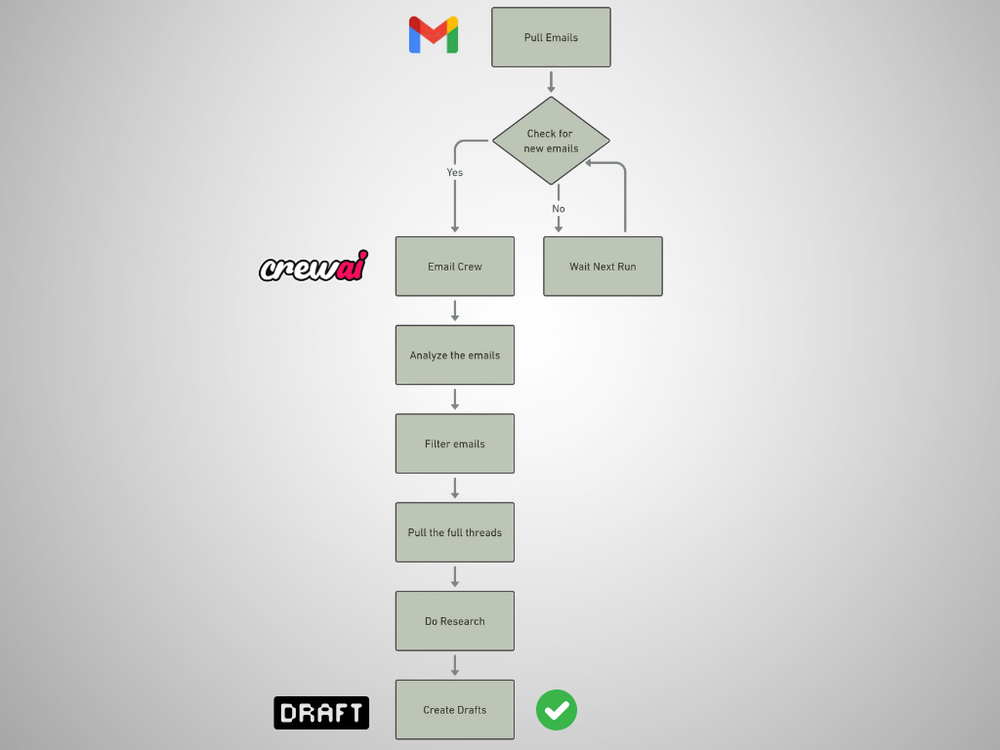
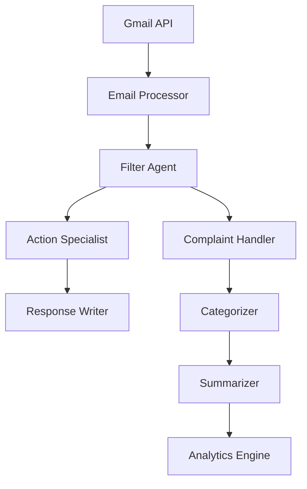

# 🤖 AI Email Assistant

An intelligent email automation system powered by CrewAI and LangGraph that transforms your inbox management through AI-driven workflows.




## 🌟 Features

- **Smart Email Filtering**: Automatically categorizes and prioritizes incoming emails
- **Complaint Management**: Identifies, categorizes, and tracks customer complaints
- **Automated Responses**: Generates contextually appropriate email responses
- **Analytics & Insights**: Tracks patterns in complaints and communication
- **Multi-Agent System**: Leverages specialized AI agents for different tasks

## 🏗️ Architecture



## 🚀 Quick Start

### Prerequisites
- Python 3.10+
- Gmail API credentials
- OpenAI API key

### Installation

```bash
# Clone the repository
git clone https://github.com/Kakachia777/CrewAI-Gmail-Assistants.git

# Install dependencies
pip install -r requirements.txt

# Set up environment variables
cp .env.example .env
```

### Configuration

1. Configure your `.env` file:
```env
OPENAI_API_KEY=your_key_here
OPENAI_MODEL_NAME=gpt-4o # or gpt-4o-mini
GMAIL_CREDENTIALS_PATH=path/to/credentials.json
```

2. Set up Gmail API:
- Follow [Google's Gmail API Setup Guide](https://developers.google.com/gmail/api/quickstart/python)
- Download credentials and save as `credentials.json` in project root

## 💻 Components

### AI Agents
- **Email Filter**: Identifies important emails
- **Action Specialist**: Determines required actions
- **Response Writer**: Drafts appropriate responses
- **Complaint Handler**: Processes customer issues
- **Analytics Agent**: Tracks patterns and trends

### Key Files
```plaintext
src/
├── graph.py      # Workflow definition
├── nodes.py      # Node functions
├── state.py      # State management
└── crew/
    ├── agents.py # AI agent definitions
    ├── tasks.py  # Task definitions
    ├── crew.py   # Agent orchestration
    └── tools.py  # Gmail tools
```

## 🔧 Usage

```python
from src.graph import WorkFlow

app = WorkFlow().app
initial_state = {
    "checked_emails_ids": [],
    "emails": [],
    "action_required_emails": {},
    "complaint_emails": [],
    "summaries": []
}
app.invoke(initial_state)
```

## 📊 Features

### Email Processing
- Automatic email categorization
- Smart response generation
- Complaint tracking
- Analytics and reporting

### Workflow States
1. Email Check
2. Filtering
3. Action Analysis
4. Response Generation
5. Complaint Processing
6. Analytics Update

## 🛠️ Development

### Running Tests
```bash
pytest tests/
```

### Contributing
1. Fork the repository
2. Create feature branch
3. Commit changes
4. Push to branch
5. Create Pull Request

## 📝 API Documentation

### Core Classes
```python
class EmailAssistant:
    def __init__(self, config: Config)
    def start(self) -> None
    def process_batch(self) -> BatchResult
```

### Event Hooks
```python
assistant.on_new_email(callback)
assistant.on_complaint_detected(callback)
assistant.on_response_generated(callback)
```

## 🔐 Security
- OAuth 2.0 authentication
- Encrypted storage
- Rate limiting
- Input validation

## 📈 Performance & Optimizations

### Caching & Memory
- Gmail toolkit initialization caching
- Optimized data structures with dataclasses
- Improved memory usage with proper garbage collection
- Efficient state management system
- Resource-aware batch processing

### Code Quality
- Type hints throughout the codebase
- Comprehensive error handling and logging
- Base agent and task creation methods
- Reduced code duplication
- Better abstraction layers

### System Architecture
- Configuration management system
- Asynchronous operations support
- Modular component design
- Scalable workflow patterns
- Enhanced tool delegation

### Monitoring & Debugging
- Performance metrics tracking
- Debug logging capabilities
- Error tracing and reporting
- State inspection tools
- Memory usage monitoring

## 🤝 Support
- [Documentation](docs/index.md)
- [Issue Tracker](https://github.com/yourusername/ai-email-assistant/issues)

## 📜 License
This project is licensed under the MIT License - see the [LICENSE](LICENSE) file for details.

---
<p align="center">Made with ❤️ by Beka Kakachia</p>
